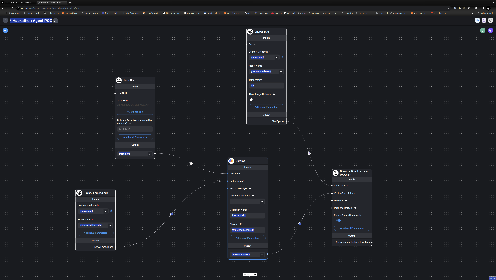

# Hackathon AI Agent POC

### Architecture of the AI Agent POC for the Hackathon


_Note: The mermaid code to generate the above diagram is in the arch.mmd file.
If any updates are needed. Update the mmd file accordingly and then do the following:_
```bash
npm install -g @mermaid-js/mermaid-cli
mmdc -i arch.mmd -o /assets/arch.svg
```

### How to run the AI Agent POC Locally
#### Tools
- Flowise AI Platform (https://flowise.ai/)
  - https://docs.flowiseai.com/getting-started
- ChromaDB (https://cookbook.chromadb.dev)
  - https://cookbook.chromadb.dev/running/running-chroma/
- OpenAI API Access 
  - confirm you have access to the OpenAI API
  - create an API key https://platform.openai.com/api-keys

#### Steps
- Get the flowise editor started on http://localhost:3000
- Get the chromadb started on http://localhost:8080
- Import the `assets/config/Flowise_Hackathon_POC_Agents.jsonn` flow into the Flowise editor
- Should see something like this:
  
- Use the OpenAI API key to set up the Connect Credentials in the OpenAI Embeddings node
- Upload the `assets/data/Hackathon_POC_Static_KB.json` file to the Json File Document Loader node
- Update the ChromaDB node with the correct URL
- Use the Upsert Vector Database on the top right of the editor to get the data from the Json File Document Loader into the ChromaDB using the embeddings from the OpenAI Embeddings node
- Now you can start the flow and interact with the AI Agent POC

### Sample Conversations
- Q: Which team was assigned to resolve Ticket #2?
  - A: The final assigned team for Ticket #2 was TeamGamma.
- Q: What environment was missing for Ticket #1’s API Access request?
  - A: Ticket #1 did not initially provide the production client ID, which was needed for the production environment.
- Q: What question was asked about data corruption in Ticket #8?
  - A: TeamGamma asked the user for the exact actions leading to the data corruption.
- Q: How was the Issue/Problem resolved in Ticket #5?
  - A: The Issue/Problem in Ticket #5 was resolved by restarting the production cluster.


